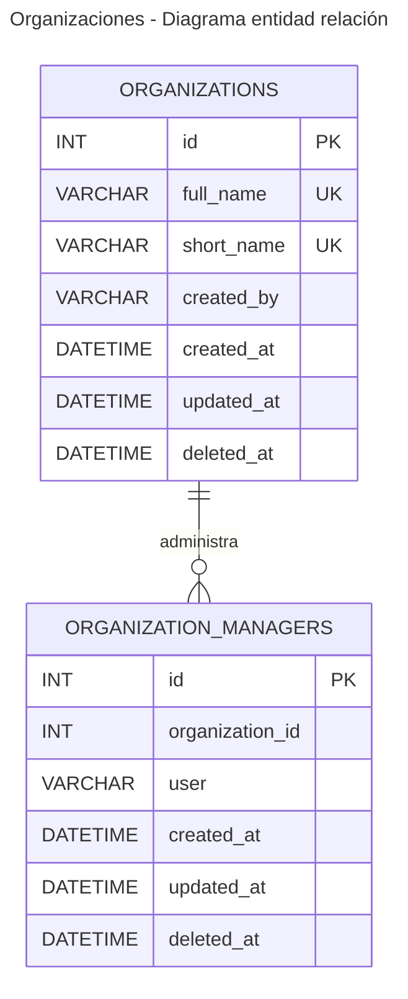

# SportsVibe - Módulo de Organizaciones.

## Namespace

**Percontmx\SportsVibe\Organizations**

## Descripción

Este módulo se encarga de gestionar las organizaciones de la aplicación.

Las organizaciones hacen referencias a federaciones, asociaciones deportivas, clubes y demás organismos que gestionan ligas deportivas.

## Modelo de datos

```mermaid
---
title: Organizaciones - Diagrama entidad relación
---
erDiagram
    o[ORGANIZATIONS] {
        INT id PK 
        VARCHAR full_name UK 
        VARCHAR short_name UK 
        VARCHAR created_by
        DATETIME created_at 
        DATETIME updated_at 
        DATETIME deleted_at 
    }

    om[ORGANIZATION_MANAGERS] {
        INT id PK
        INT organization_id
        VARCHAR user
        DATETIME created_at
        DATETIME updated_at
        DATETIME deleted_at
    }

    o 1 to zero or more om : administra

```

## Dependencias

Este módulo no depende, al momento, de ningun otro módulo.

## Eventos

Este módulo dispara los siguientes eventos:

| Evento | Disparador | Parámetros |
|--------| ----- | ---- |
| `organizations.new` | Al crear una nueva organización. | [Organization](src/Entities/Organization.php) `$newOrg` |
| `organizations.disable` | Al desabilitar a una organización. | INT `$organizationId` |
| `organizations.manager_added` | Al agregar un administrador | ARRAY `$data` |
| `organizations.manager_removed` | Al deshabilitar un administrador | INT `$organizationId`, STRING `$user` |

