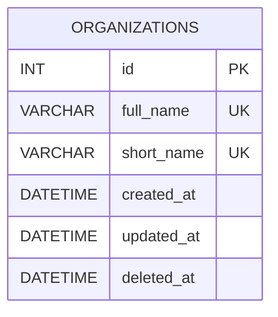

# SportsCloud - Módulo de Organizaciones.

## Namespace

**Percontmx\SportsCloud\Organizations**

## Descripción

Este módulo se encarga de gestionar las organizaciones de la aplicación.

Las organizaciones hacen referencias a federaciones, asociaciones deportivas, clubes y demás organismos que gestionan ligas deportivas.

## Modelo de datos

## Dependencias

Este módulo no depende, al momento, de ningun otro módulo.
